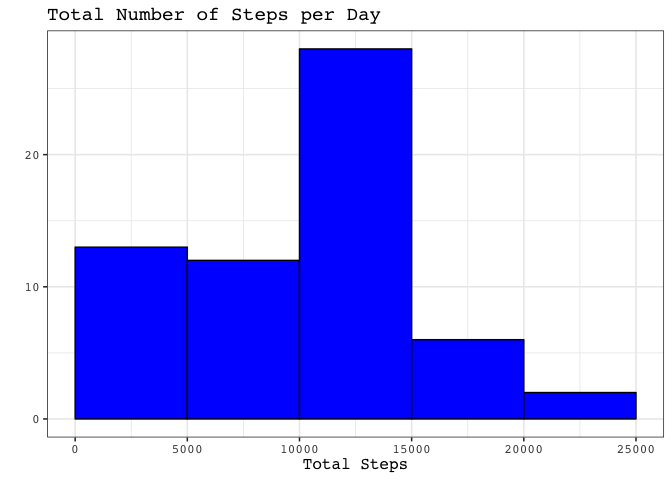
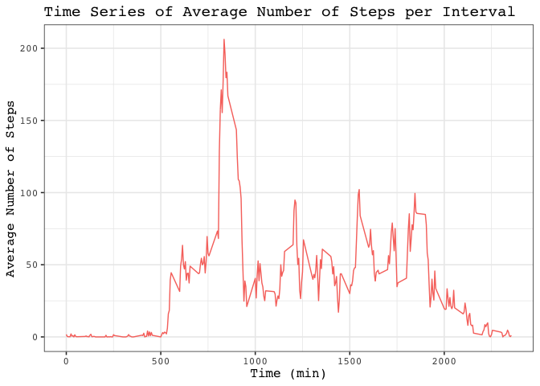
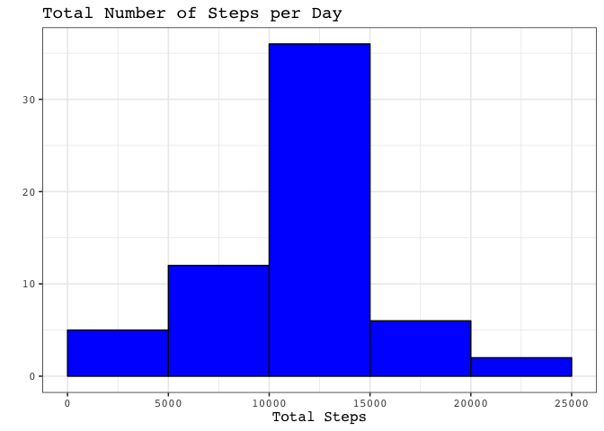
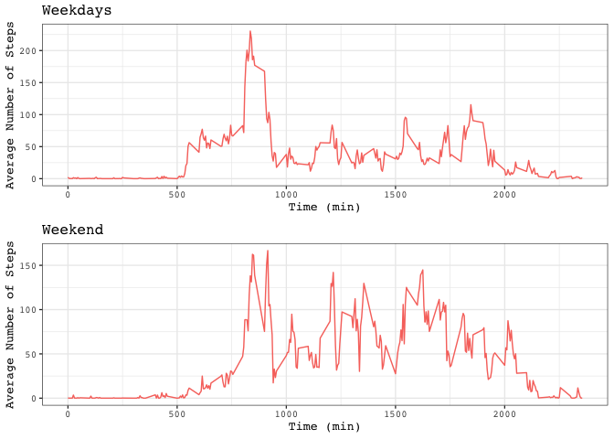

## Loading and preprocessing the data
First, we read the raw data from the `activity.csv` file and save them to the data frame 
`acitivty`. Note that, the data in the second column `date` is reset to the `as.Date`-format.


```r
unzip("activity.zip")
activity <- read.csv("activity.csv", header = TRUE)
activity[, 2] <- as.Date(activity$date)
```

The data frame looks now as follows:


```r
str(activity)
```

```
## 'data.frame':	17568 obs. of  3 variables:
##  $ steps   : int  NA NA NA NA NA NA NA NA NA NA ...
##  $ date    : Date, format: "2012-10-01" "2012-10-01" ...
##  $ interval: int  0 5 10 15 20 25 30 35 40 45 ...
```

For the plots we use `ggplot2` and `gridExtra`:


```r
library(ggplot2)
library(gridExtra)
```

## What is mean total number of steps taken per day?

We create a histogram of the total steps taken per day:


```r
StepsDay <- with(activity, tapply(steps, date, sum, na.rm = TRUE))
qplot(StepsDay,
      geom = "histogram", 
      bins = "5", 
      main = "Total Number of Steps per Day", 
      xlab = "Total Steps", 
      fill = I("blue"),
      col = I("black"),
      breaks = seq(0, 25000, by = 5000)) + 
      theme_bw(base_family = "Courier", base_size = 12)
```

<!-- -->


```r
MeanSteps <- mean(StepsDay)
```

The mean of steps taken per day is 9354.2295082, 


```r
MedianSteps <- median(StepsDay)
```

and the median is 10395. 

## What is the average daily activity pattern?
We start by looking at the time series of the 5-minute interval and the average number of 
steps taken, averaged across all days.


```r
AverageSteps <- with(activity, tapply(steps, interval, mean, na.rm=TRUE))
Intervals <- unique(activity$interval)
qplot(x = Intervals, 
      y = AverageSteps, 
      main = "Time Series of Average Number of Steps per Interval", 
      xlab = "Time (min)", 
      ylab = "Average Number of Steps",
      colour = "red", 
      geom = "line") + 
      theme_bw(base_family = "Courier", base_size = 12) + 
      theme(legend.position="none")
```

<!-- -->

In order to find out which 5-minute interval, on average across all the days in the dataset, 
contains the maximum number of steps, we put the previously defined variables `Intervals` and 
`Average steps` in one data frame. Then, the index with the maximum number of average steps 
can easily be found. 


```r
temp <- data.frame(cbind(Intervals, AverageSteps))
MaxIndex <- which.max(temp$AverageSteps)
MaxInt <- temp[MaxIndex, 1]
```

Therefore, the interval 835 contains the maximum number of steps.

## Imputing missing values

There are a number of days/intervals where there are missing values (coded as NA). 
The presence of missing days may introduce bias into some calculations or summaries of the 
data.


```r
IsNa <- sum(is.na(activity$steps))
```

The total number of missing values in the data set are 2304.

Now, we fill the missing values of the data set by the mean for that 5-minute interval 
averaged over all days computed above. 


```r
NaIndex <- which(is.na(activity$steps))
activityMod <- activity
for(i in 1:length(NaIndex))
{
  NaInt <- activityMod$interval[NaIndex[i]]
  activityMod[NaIndex[i], 1] <- temp[temp == NaInt, 2][1]
}
```

Therefore, the new data frame `acitivityMod` contains the same information as `activity`, but 
has no missing values.


```r
StepsDayMod <- with(activityMod, tapply(steps, date, sum, na.rm = TRUE))
qplot(StepsDayMod,
      geom = "histogram", 
      bins = "5", 
      main = "Total Number of Steps per Day", 
      xlab = "Total Steps", 
      fill = I("blue"),
      col = I("black"),
      breaks = seq(0, 25000, by = 5000)) + 
      theme_bw(base_family = "Courier", base_size = 12)
```

<!-- -->

The effect of imputing the missing values is that the distribution is not anymore 
skewed towards a small number of steps per day as above. 


```r
MeanStepsMod <- mean(StepsDayMod)
```

The mean of steps taken per day is now 10766.19, 


```r
MedianStepsMod <- median(StepsDayMod)
```

and the median is 10766.19. 

Both values differ from the ones computed where we simply ignored the missing values. In fact 
both values are larger than previously. Note, that mean and median are equal now.

## Are there differences in activity patterns between weekdays and weekends?

First, we create a new factor variable in the dataset with two levels "weekday" and "weekend" 
indicating whether a given date is a weekday or weekend day. We need the `dplyr` package for 
this issue.


```r
library(dplyr)
```

```
## 
## Attaching package: 'dplyr'
```

```
## The following object is masked from 'package:gridExtra':
## 
##     combine
```

```
## The following objects are masked from 'package:stats':
## 
##     filter, lag
```

```
## The following objects are masked from 'package:base':
## 
##     intersect, setdiff, setequal, union
```

```r
activityMod <- mutate(activityMod, 
                      day = ifelse(weekdays(activity$date) == "Saturday" |     
                                   weekdays(activity$date) == "Sunday", "weekend", 
                                   "weekday"))
activityMod$day <- as.factor(activityMod$day)
```

Now we are able to plot the average number of steps taken over the 5-minute intervals, 
averaged across all weekday days or weekend days.


```r
ActivityWeekend <- subset(activityMod, as.character(activityMod$day) == "weekend")
ActivityWeekday <- subset(activityMod, as.character(activityMod$day) == "weekday")

AverageStepsWeekend<-with(ActivityWeekend, tapply(steps, interval, mean, na.rm = TRUE))
AverageStepsWeekday<-with(ActivityWeekday, tapply(steps, interval, mean, na.rm = TRUE))

par(mfrow = c(2,1), mar = c(4,4,2,1))
p1 <- qplot(x = Intervals, 
            y = AverageStepsWeekday, 
            main = "Weekdays", 
            xlab = "Time (min)", 
            ylab = "Average Number of Steps",
            colour = "red", 
            geom = "line") + 
            theme_bw(base_family = "Courier", base_size = 10) + 
            theme(legend.position="none")
p2 <- qplot(x = Intervals, 
            y = AverageStepsWeekend, 
            main = "Weekend", 
            xlab = "Time (min)", 
            ylab = "Average Number of Steps",
            colour = "red", 
            geom = "line") + 
            theme_bw(base_family = "Courier", base_size = 10) + 
            theme(legend.position="none")
grid.arrange(p1, p2, ncol = 1, nrow = 2)
```

<!-- -->

The average number of steps taken over weekends is larger than over weekdays on average.
